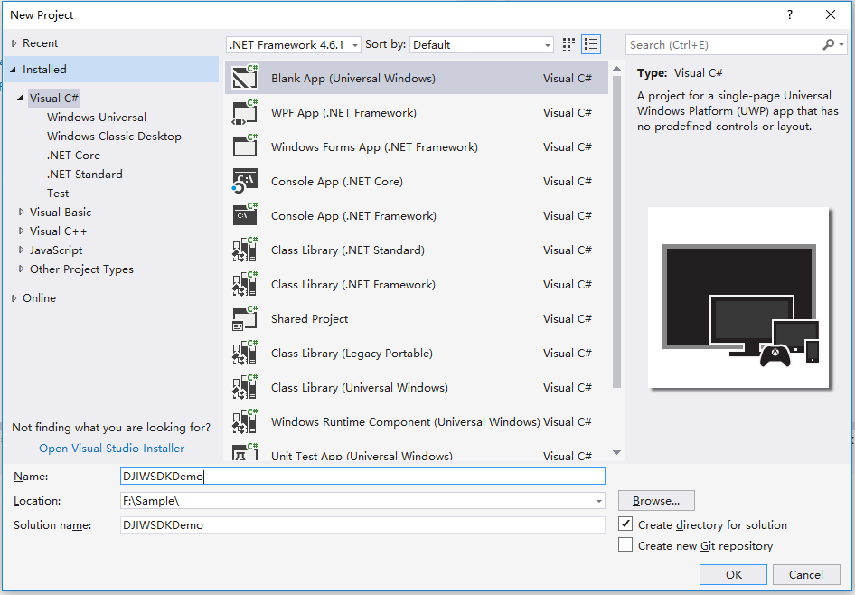
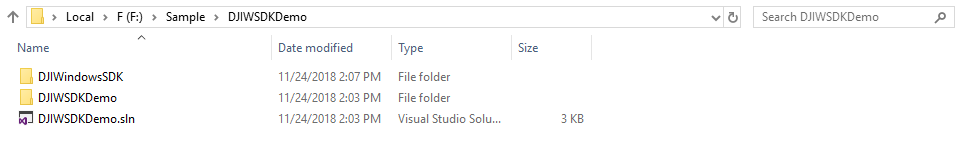
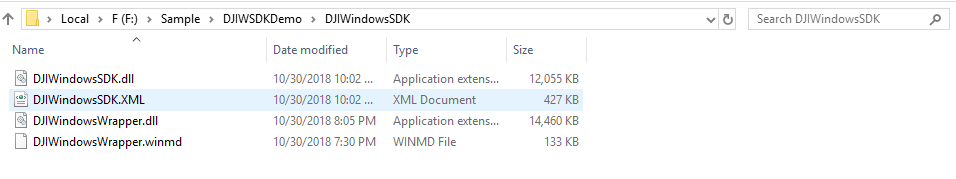
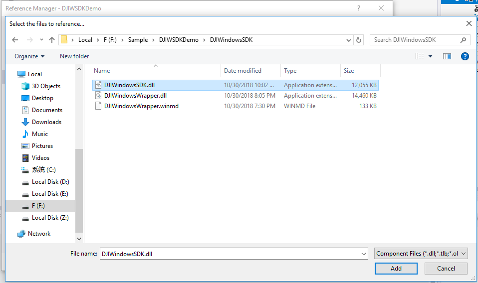
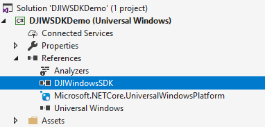
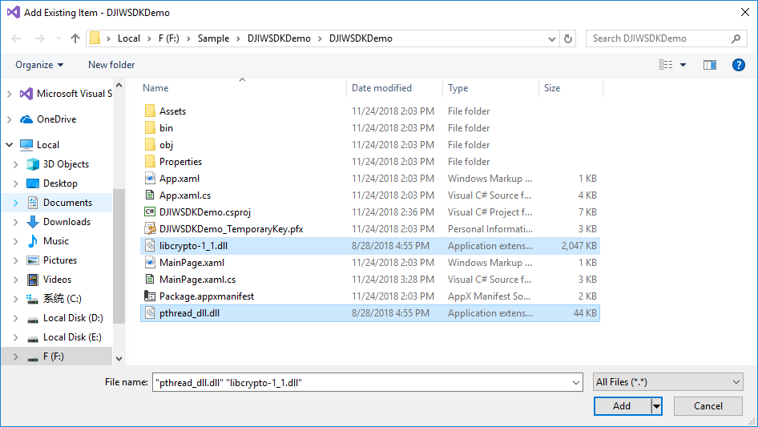
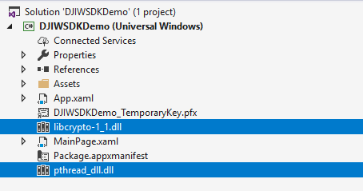
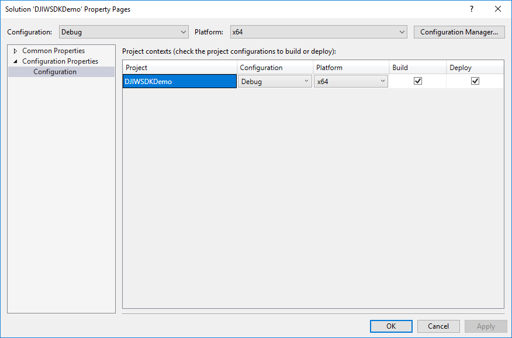
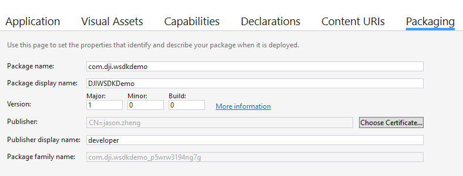
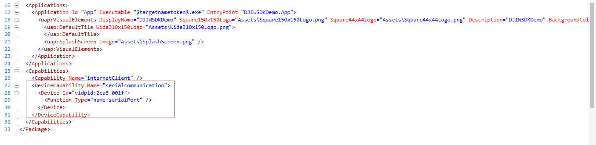

The example below shows how to import the DJI Windows SDK into a new UWP project. The same steps can be used for integrating into an existing application project.

**Screenshots in this section are generated using Visual Studio 2017.**

## Create a New UWP Application

   * Open Visual Studio 2017.
   * Select **File->New->Project**.
   * Choose **Blank App(Universal Windows)** template.
   * Fill in the project name and choose the location of the project
   * Press **OK**.
   * "DJIWSDKDemo" will be used as the **Project Name**.
   * Choose the **Target version** and **Minimum version**
        
      

## Import WSDK into the Project

   * Firstly, create a folder named "DJIWindowsSDK", and copy all the DJI Windows SDK library files in it.
   
   
   * Secondly, add reference of **DJIWindowsSDK** to your project. 
     * a. Right-click on DJIWSDKDemo project, and select **Add Reference**.
     * b. Select **Browse**, and select **DJIWindowsSDK.dll**. Click **Add**.
     * c. Click **OK**.
     
     
   * Thirdly, add dll files of third parties to the project.
     * a. Copy dll files of third parties(**pthread_dll.dll** and **libcrypto-1.1.dll**, for x86) to the root path of the project
     * b. Right-click on DJIWSDKDemo project, select **Add->Existing Item**, and click the dlls needed.
     
     

## Configure Properties

   * Right-click on the **Solution 'DJIWSDKDemo'**, select **Properties**.
   * Make sure that the **Platform** configuration is suitable for DJI Windows SDK x86.
   
   * Double-click on **Package.appxmanifest**, select **Packaging**, and fill in the **Package name** with your application's package name. Here, we use "com.dji.wsdkdemo".
   
   * Configure serial port authority in order to connect the application to DJI Aircraft's remote controller. Right-click on **Package.appxmanifest**, select **View Code**, add the following code in the **Capabilities** element. 

~~~csharp
<DeviceCapability Name="serialcommunication">
    <Device Id="vidpid:2ca3 001f">
        <Function Type="name:serialPort" />
    </Device>
</DeviceCapability>
~~~

## Generate an App Key

Every application needs a unique App Key to initialize the SDK.

To create an App Key for an application:

Go to the DJI Developer Website's <a href="http://developer.dji.com/en/user/apps" target="_blank">Developer Center</a>

*    Select "Apps" tab on the left.
*    Select "Create App" button on the right.
*    Select "Windows SDK" as the "SDK" type.
*    Select the "Category", enter the **App Name**, **Package Name** and "Description" of the application.
*    An application activation email will be sent to complete the App Key generation.
*    The App Key will appear in the developer center, and can be copied and pasted into the application.

## Register Application
 
   * Double click on **MainPage.xaml.cs**.
   * Import namespace of DJI Windows SDK in the **MainPage.xaml.cs** file.

~~~csharp
using DJI.WindowsSDK;
~~~

   * Create a new method `Instance_SDKRegistrationEvent`.
   * Add `SDKRegistrationStateChanged` event listening with method `Instance_SDKRegistrationEvent`.
   * Invoke `RegisterApp()` method in `MainPage()` as shown below:

~~~csharp
public MainPage()
{
    this.InitializeComponent();
    DJISDKManager.Instance.SDKRegistrationStateChanged += Instance_SDKRegistrationEvent;

    //Replace with your registered App Key. Make sure your App Key matched your application's package name on DJI developer center.
    DJISDKManager.Instance.RegisterApp("Please enter your App Key here.");
}

private async void Instance_SDKRegistrationEvent(SDKRegistrationState state, SDKError resultCode)
{
    if (resultCode == SDKError.NO_ERROR)
    {
    	System.Diagnostics.Debug.WriteLine("Register app successfully.");

        //The product connection state will be updated when it changes here.
        DJISDKManager.Instance.ComponentManager.GetProductHandler(0).ProductTypeChanged += async delegate (object sender, ProductTypeMsg? value)
        {
            await Dispatcher.RunAsync(Windows.UI.Core.CoreDispatcherPriority.Normal, async () =>
            {
                if (value != null && value?.value != ProductType.UNRECOGNIZED)
                {
                    System.Diagnostics.Debug.WriteLine("The Aircraft is connected now.");
                    //You can load/display your pages according to the aircraft connection state here.
                }
                else
                {
                    System.Diagnostics.Debug.WriteLine("The Aircraft is disconnected now.");
                    //You can hide your pages according to the aircraft connection state here, or show the connection tips to the users.
                }
            });
        };

        //If you want to get the latest product connection state manually, you can use the following code
        var productType = (await DJISDKManager.Instance.ComponentManager.GetProductHandler(0).GetProductTypeAsync()).value;
        if (productType != null && productType?.value != ProductType.UNRECOGNIZED)
        {
            System.Diagnostics.Debug.WriteLine("The Aircraft is connected now.");
            //You can load/display your pages according to the aircraft connection state here.
        }
    }
    else
    {
        System.Diagnostics.Debug.WriteLine("Register SDK failed, the error is: ");
        System.Diagnostics.Debug.WriteLine(resultCode.ToString());
    }
}
~~~

## Run WSDK Demo

Internet connection is required to registration the application successfully. As this application is only demonstrating the registration process of DJI Windows SDK and not interact directly with a DJI product, so no need to connect to a DJI product to run this application. 

If everything goes well, you should be able to see the following log in the popup window: **Register app successfully.**

