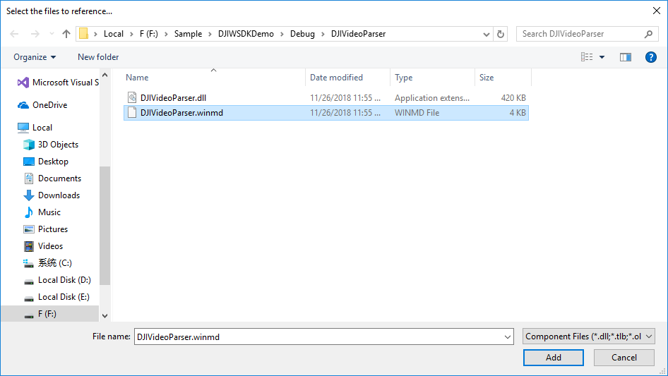
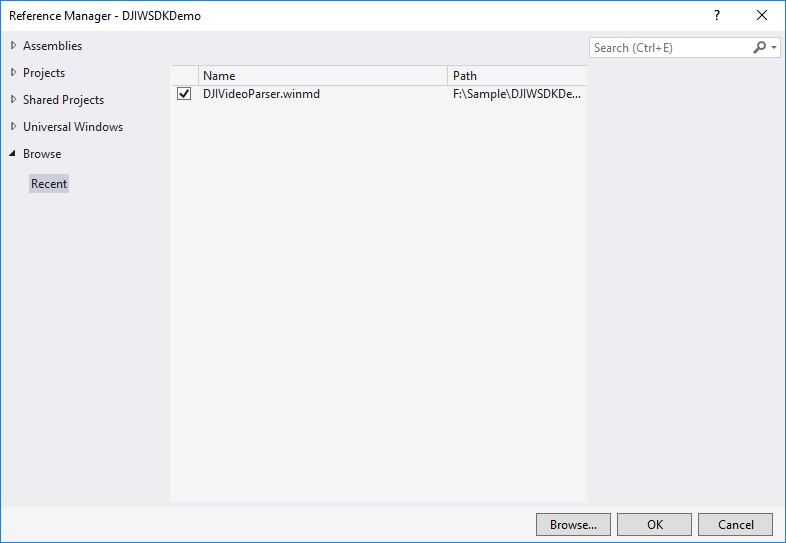
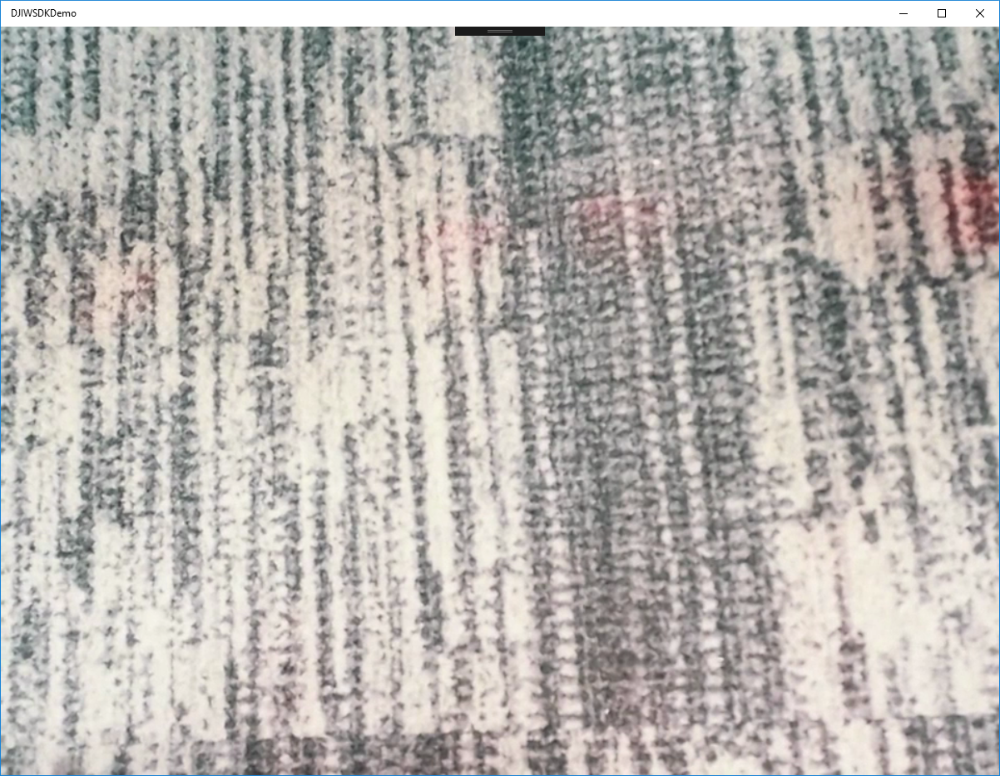

*If you come across any mistakes or bugs in this tutorial, please let us know using a Github issue, a post on the DJI forum. Please feel free to send us Github pull request and help us fix any issues.*

---

This tutorial is designed for you to gain a basic understanding of the DJI Windows SDK. It will implement the FPV view.

You can download the tutorial's final sample project from this [Github Page](https://github.com/DJI-Mobile-SDK-Tutorials/iOS-FPVDemo).
   
We use Phantom 4 Pro V2.0 as an example to make this demo.

## Import DJIVideoParser Project

Based on the DJIWSDKDemo, now we start to import DJIVideoParser project.

* Firstly, copy DJIVideoParser project to root folder of DJIWSDKDemo. You can find DJIVideoParser project [here](https://github.com/dji-sdk/Windows-SDK/tree/master/Sample%20Code).

* Secondly, add DJIVideoParser project.
  * a. Open DJIWSDKDemo solution, right-click on the solution, select **Add->Existing Project**.
  * b. Locate to the folder where DJIVideoParser.vcxproj exists, select it and click **Open**.
* Thirdly, configurate DJIVideoParser project.
  * a. Right-click on the DJIVideoParser project, select **Properties**.
  * b. Pay attention to following points: **Configuration, Platform, Target Platform Version** and **Output Directory**.
  
* Fourthly, add reference to DJIWSDKDemo.
  * a. Build DJIVideoParser project. Pay attention to the product after building.
  * b. Right-click on DJIWSDKDemo project, and select **Add Reference**, and then click **Browse**.
  * c. Locate to the folder where DJIVideoParser.winmd was generated above. Select it and click **Add**.
  
  * d. Check the box of DJIVideoParser.winmd and click **OK**.(You don't need to check the box of DJIWindowsSDK.dll if you have added it before.)
  
* Finally, copy FFMpeg dlls to DJIWSDKDemo project.
  * a. Right-click on the DJIWSDKDemo project. Select **Add->Existing Item**.
  * b. Locate to dlls of FFMpeg(under the folder of /DJIVideoParser/ThirdParties/dlls).
  * c. Select all of them, and then click **Add**.
  

## Application Activation and Aircraft Binding in China

 For DJI Windows SDK application used in China, it's required to activate the application and bind the aircraft to the user's DJI account. 

 If an application is not activated, or the aircraft not bound (if required), all **camera live streams** will be disabled, and flight will be limited to a zone of 100m diameter and 30m height to ensure the aircraft stays within line of sight.

 To learn how to implement this feature, please check this tutorial [Application Activation and Aircraft Binding](./ActivationAndBinding.html).

## Implementing the First Person View

  * **1**. Add FPV image view. Double-click on the **MainPage.xaml** to open it. We can see there is a **Grid** declaration. Add an **Image** element named "FPVImage" inside it.
  
  * **2**. Add video data parser and container. Double-click on the **MainPage.xaml.cs** to open it. Add the following elements inside MainPage.

~~~csharp
//use videoParser to decode raw data.
private DJIVideoParser.Parser videoParser;
//decoded data container
private byte[] decodedDataBuf;
//FPV image source
private WriteableBitmap VideoSource;
//multi-thread protect
private object bufLock = new object();
~~~
  * **3**. Add video raw data and decoded data callback. Add the following methods inside **Class MainPage**.

~~~csharp
//raw data
void OnVideoPush(VideoFeed sender, [ReadOnlyArray] ref byte[] bytes)
{
    videoParser.PushVideoData(0, 0, bytes, bytes.Length);
}

//decode data
async void ReceiveDecodedData(byte[] data, int width, int height)
{
    lock (bufLock)
    {
        if (decodedDataBuf == null)
        {
            decodedDataBuf = data;
        }
        else
        {
            data.CopyTo(decodedDataBuf.AsBuffer());
        }
    }
    await Dispatcher.RunAsync(Windows.UI.Core.CoreDispatcherPriority.Normal, () =>
    {
        if (VideoSource == null || VideoSource.PixelWidth != width || VideoSource.PixelHeight != height)
        {
            VideoSource = new WriteableBitmap((int)width, (int)height);
            FPVImage.Source = VideoSource;
        }

        lock (bufLock)
        {
            decodedDataBuf.AsBuffer().CopyTo(VideoSource.PixelBuffer);
        }
        VideoSource.Invalidate();
    });
}
~~~
  * **4**. Add raw data and decoded data listener after registering app successfully.

~~~csharp
//listen video receive data
if (videoParser == null)
{
    videoParser = new DJIVideoParser.Parser();
    videoParser.Initialize();
    videoParser.SetVideoDataCallack(0, 0, ReceiveDecodedData);
    DJISDKManager.Instance.VideoFeeder.GetPrimaryVideoFeed(0).VideoDataUpdated += OnVideoPush;
}
~~~

## Connecting to the Aircraft

Please check this [Connect Mobile Device and Run Application](../application-development-workflow/workflow-run.html#connect-mobile-device-and-run-application) guide to run the application and view the live video stream from your DJI product's camera based on what we've finished of the application so far!
  
## Enjoying the First Person View

Run the demo now. If you can see the live video stream in the application, congratulations!

  

### Summary
   
   In this tutorial, you’ve learned how to use DJI Windows SDK to show the FPV View from the aircraft's camera. These are the most basic and common features in a typical drone app. However, if you want to create a drone app which is more fancy, you still have a long way to go. More advanced features should be implemented, including previewing the photo and video in the SD Card, showing the OSD data of the aircraft and so on. Hope you enjoy this tutorial, and stay tuned for our next one!
   
