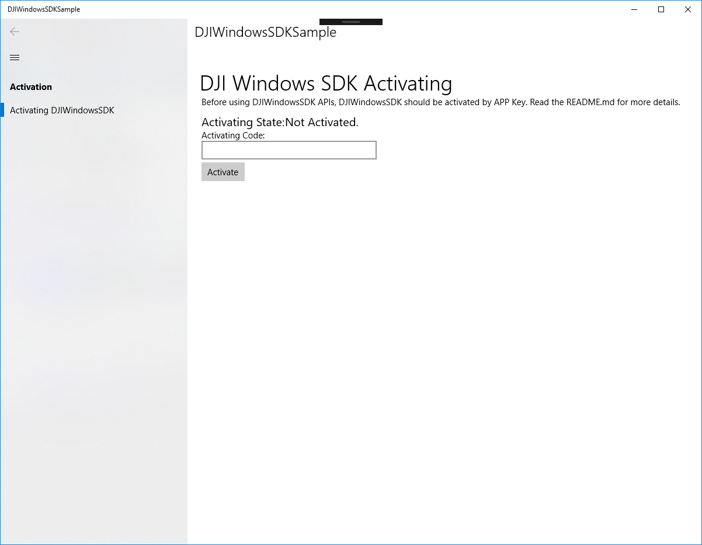
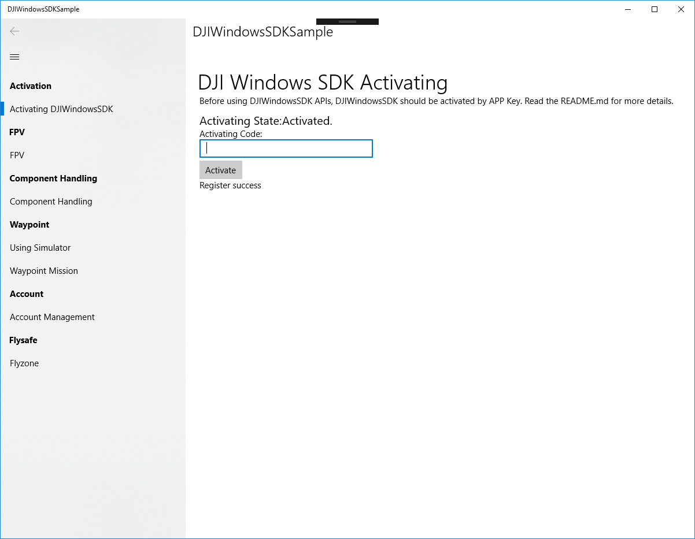

## Register as a DJI Developer

Register for a DJI Developer account here: <a href="http://developer.dji.com/register" target="_blank">http://developer.dji.com/register</a>.

During the registration process, email information and a credit card or phone number will need to be supplied to verify registration. Any credit card information given will only be used for verification and will not be charged.

This guide assumes Visual Studio 2017 with Windows 10 SDK (Version 1803 or higher).

## Generate an App Key

Every application needs a unique App Key to initialize the SDK.

To create an App Key for an application:

Go to the DJI developer <a href="http://developer.dji.com/en/user/apps" target="_blank">User Center</a>

*    Select the "Apps" tab on the left.
*    Select the "Create App" button on the right.
* Enter the name, platform, package identifier, category and description of the application.
* An application activation email will be sent to complete App Key generation.
* The App Key will appear in the user center, and can be copied and pasted into the application.

## Windows Sample App

### Products Connection Environment Setup

The supported DJI products of DJI Windows SDK include Mavic Air and Phantom 4 Pro V2.
 
For Mavic Air, only WiFi connection is supported. Therefore, the PC or the laptop should have a WiFi adapter.

For Phantom 4 Pro V2, USB connection is supported. Setup the connection with the following steps:

  * Install DJI Assistant 2 on the PC.
  * Ensure the remote controller has firmware version 01.00.200 or above. Use DJI GO 4 or DJI Assistant 2 to upgrade the remote controller if the firmware is old.
  * Make sure the remote controller is powered off.
  * Use a USB cable to connect PC with the remote controller. **CAUTION:** Use the mini-USB port of the remote controller instead of the Type A port.
  * Power on the remote controller.
  * Go to Device Manager of Windows. If the remote controller is connected successfully, you should see two devices in the list: Remote NDIS based Internet Sharing Device #1 and DJI USB Virtual COM (COM1). The number and the COM index may show differently across PC machines.

**CAUTION:** It is necessary to power off the remote controller first and connect it to PC after. The remote controller will determine whether to enable PC mode during booting. If the remote controller disconnects from the PC, it has to be powered off before re-connecting to the PC.

### Windows Sample Code Setup

Download or clone the UWP Sample Github Project from: <a href="https://github.com/dji-sdk/Windows-SDK/tree/master/Sample%20Code" target="_blank">https://github.com/dji-sdk/Windows-SDK/tree/master/Sample Code</a>.

#### Run Sample Code With App Key

* Open DJIWindowsSDKSample.sln. Because the dependencies and the video parser has been configured in this sample, just compile and run it using x86 as the architecture.

* To start browsing all the features in the sample, you have to input the APP key. Following the previous section and use "com.wsdk.sample" as the package name to generate an APP key.

* After SDK registers successfully, you should see the full list of features.

